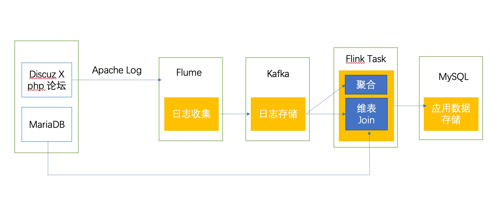
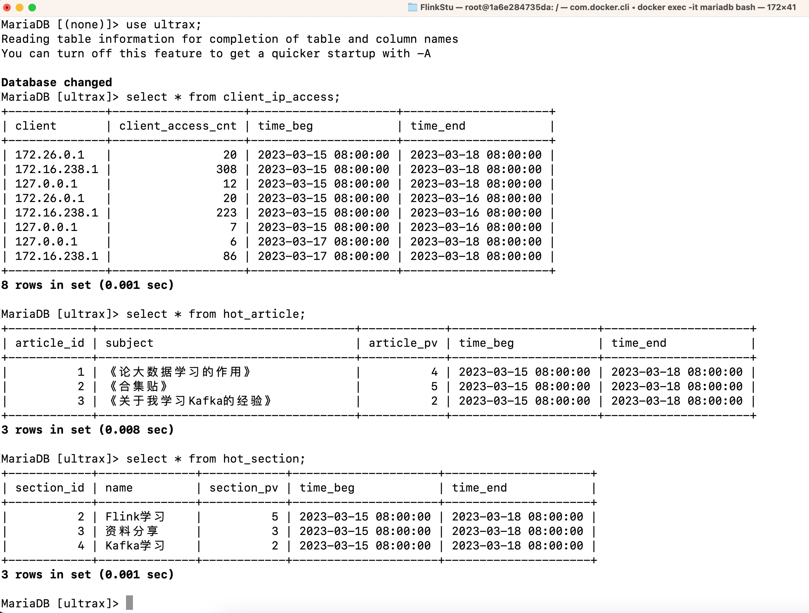

# flink-log-analysis
## 项目架构图
基于Flink的实时用户行为日志分析系统，基本架构图如下：

## 代码结构


首先会先搭建一个论坛平台，对论坛平台产生的用户点击日志进行分析。然后使用Flume日志收集系统对产生的Apache日志进行收集，并将其推送到Kafka。接着我们使用Flink对日志进行实时分析处理，将处理之后的结果写入MySQL供前端应用可视化展示。本文主要实现以下三个指标计算：

- 统计热门板块，按照时间窗口进行用户的访问板块统计
- 统计热门文章，按照时间窗口进行用户的访问文章统计
- 统计不同客户端对版块和文章的总访问量


### Apache日志格式介绍

```bash
192.168.10.1 - - [30/Aug/2020:15:53:15 +0800] "GET /forum.php?mod=forumdisplay&fid=43 HTTP/1.1" 200 30647 "http://kms-4/forum.php" "Mozilla/5.0 (Windows NT 10.0; Win64; x64) AppleWebKit/537.36 (KHTML, like Gecko) Chrome/84.0.4147.135 Safari/537.36"
```

上面的日志格式共有9个字段，分别用空格隔开。每个字段的具体含义如下：

```bash
192.168.10.1 ##(1)客户端的IP地址
- ## (2)客户端identity标识,该字段为"-"
- ## (3)客户端userid标识,该字段为"-"
[30/Aug/2020:15:53:15 +0800] ## (4)服务器完成请求处理时的时间
"GET /forum.php?mod=forumdisplay&fid=43 HTTP/1.1" ## (5)请求类型 请求的资源 使用的协议
200 ## (6)服务器返回给客户端的状态码，200表示成功
30647 ## (7)返回给客户端不包括响应头的字节数，如果没有信息返回，则此项应该是"-"
```

关于上面的日志格式，可以使用正则表达式进行匹配：

```bash
(\d{1,3}\.\d{1,3}\.\d{1,3}\.\d{1,3}) (\S+) (\S+) (\[.+?\]) (\"(.*?)\") (\d{3}) (\S+)")
```

## 论坛搭建
使用dockerfile进行搭建

compose文件目录： resouces/discuz/docker-compose.yml

访问地址： ***http://localhost:41062/***
## Flume与Kafka集成
使用dockerfile进行搭建

compose文件目录： resouces/flumekafka/docker-compose.yml

使用Flume对产生的Apache日志进行收集，然后推送至Kafka。需要启动Flume agent对日志进行收集，对应的配置文件如下：

```bash
# agent的名称为a1
a1.sources = source1
a1.channels = channel1
a1.sinks = sink1

# set source
a1.sources.source1.type = TAILDIR
a1.sources.source1.filegroups = f1
a1.sources.source1.filegroups.f1 = /opt/lampp/logs/access_log
a1sources.source1.fileHeader = false

# 配置sink
a1.sinks.sink1.type = org.apache.flume.sink.kafka.KafkaSink
a1.sinks.sink1.brokerList=localhost:9092
a1.sinks.sink1.topic= user_access_logs
a1.sinks.sink1.kafka.flumeBatchSize = 20
a1.sinks.sink1.kafka.producer.acks = 1
a1.sinks.sink1.kafka.producer.linger.ms = 1
a1.sinks.sink1.kafka.producer.compression.type = snappy

# 配置channel
a1.channels.channel1.type = file
a1.channels.channel1.checkpointDir = /home/kms/data/flume_data/checkpoint
a1.channels.channel1.dataDirs= /home/kms/data/flume_data/data

# 配置bind
a1.sources.source1.channels = channel1
a1.sinks.sink1.channel = channel1

```
### 启动Flume Agent

将启动Agent的命令脚本:

```shell
/opt/modules/apache-flume-1.9.0-bin/bin/flume-ng agent --conf-file /opt/modules/apache-flume-1.9.0-bin/conf/log_collection.conf --name a1 -Dflume.root.logger=INFO,console 
```
### 查看push到Kafka的日志数据

控制台消费者命令脚本：
```bash
bin/kafka-console-consumer.sh  --bootstrap-server localhost:9092  --topic $1 --from-beginning
```

使用下面命令消费Kafka中的数据：

```shell
[kms@kms-2 kafka_2.11-2.1.0]$ ./kafka-consumer.sh  user_access_logs
```

## 日志分析处理流程

详见 src/main/java/com/jax/analysis/task

共有三个Flink计算任务，分别运行

此时访问论坛，点击板块和帖子文章，观察数据库变化：



## 总结

基于Flink构建一个用户行为日志分析系统。首先，基于discuz搭建了论坛平台，针对论坛产生的日志，使用Flume进行收集并push到Kafka中；接着使用Flink对其进行分析处理；最后将处理结果写入MySQL供可视化展示使用。
